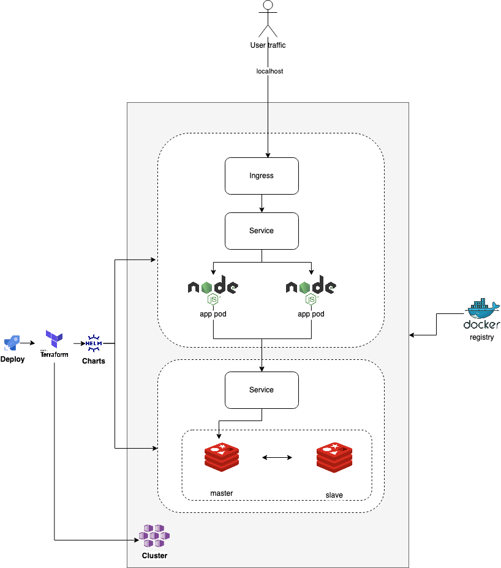

#### Prerequisites

- Terraform >=1.0.0
- Kubectl (tested on v1.23.4)
- Docker
- Helm >=3.0
- Curl

#### Steps to build and run

##### Create Kind Registry, Build and Deploy Application:
```sudo ./deploy.sh```

Once deployed, the application is exposed via an ingress, and can be accessed at:

```curl http://localhost```

The application also connects to Redis, when calling this endpoint:

```curl http://localhost/user/${id}```

The service behind this endpoint for a given ID, increments a counter and returns the number of times the endpoint has been called for the given ID. The state for the application is stored and retrieved from Redis as a stringified JSON.

eg: `curl http://localhost/user/234` will return: `{"id":"234","count":1}`

#### Tools Used:

- Helm
- Docker
- Terraform
- Kind Kubernetes

#### Architecture and Implementation Details

Docker images are hosted in a local kind docker registry. It is connected to the kind cluster by making it part of the same docker network.

The Node application has been dockerised, and pushed to a local docker kind registry.

A Kind kubernetes cluster is created that will host the Node application pods and Redis pods.

Helm charts are used to package the Node application, and a chart for Redis is retrieved from Bitnami during deployment.

These helm charts are managed and deployed via Terraform, providing an easy way to deploy and clean up the cluster of the Node application and Redis kubernetes resources.

The application once deployed is exposed via an ingress on localhost: `http://localhost`

For "high availability", 5 pods are instantiated at a minimum, and allowed to scale automatically dependant on the load on the pods.

Environment variables are maintained in a configmap.

Readiness and liveness probes are provided using the `/ping` route in the Node application.

#### Potential Improvements:

- For high availability and resiliency, on a cloud provider's infrastructure, the infrastructure can be deployed across availability zones, as well as across regions, for high availability and greater resiliency.
- Have additional namespaces for dev, staging and production for the Node app to follow an SDLC process that promotes through different environments before hitting production. The helm chart for the Node app is templated, so it can easily be updated for deployments to dev, staging and production namespaces
- For continuous development of the application, have it deployed via a CICD tool such as Jenkins, rather than Terraform. Use Terraform to manage the core infrastructure, such as creation of the Kubernetes clusters.
- Furthermore, the CICD process can be split into CI governed by tools like Jenkins, and CD + CO (Continuous Delivery + Continous Operations) governed by cloud native tools such as fluxCD or ArgoCD, providing a versioned and auditable process of deploying applications by using Git as a source of truth.

#### Architecture:

